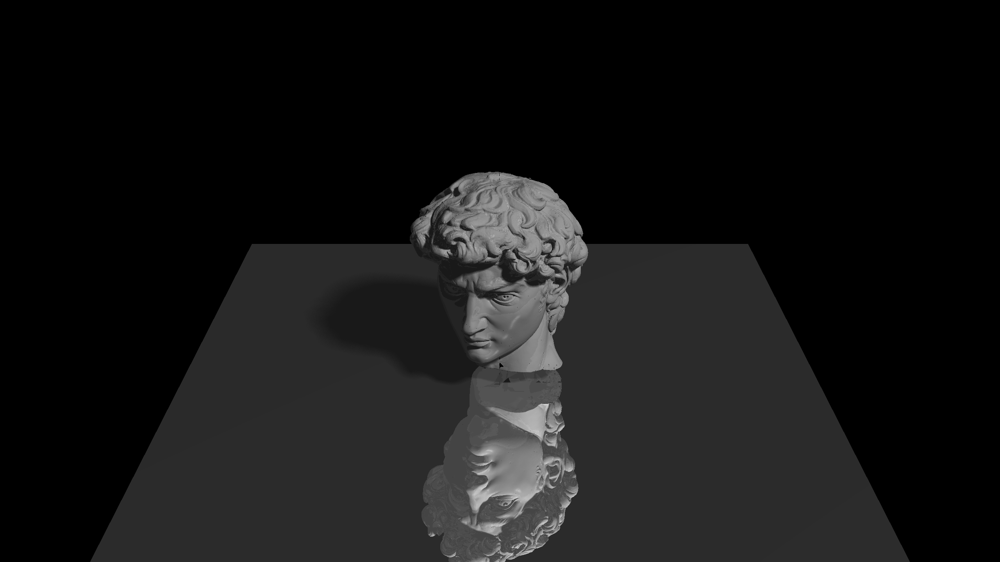
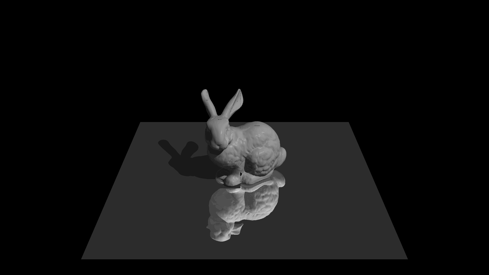
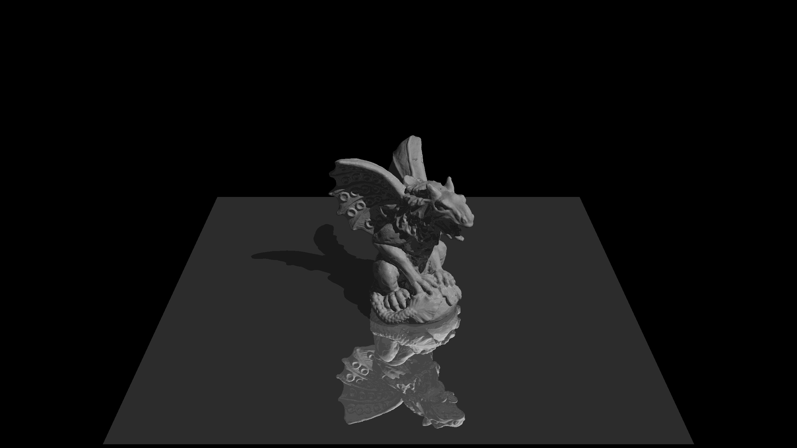
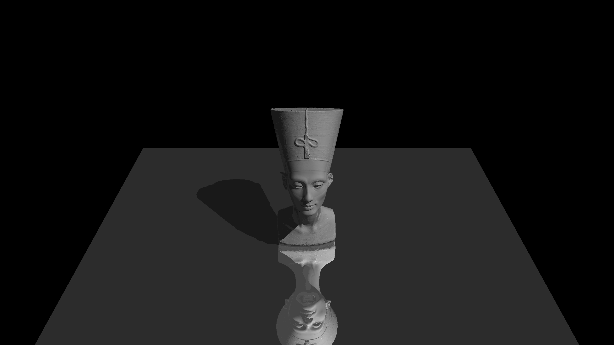

# Computer Graphics Project - JHU 601.457 - Fall 2021

This project is an image editor, raytracer, and OpenGL renderer all-in-one. It was developed as part of 601.457 Computer Graphics at Johns Hopkins University in Fall 2021.

## Features

- Image Editor: Edit and manipulate images using various tools and filters.
- Raytracer: Render 3D scenes using ray tracing techniques.
- OpenGL Renderer: Utilize the power of OpenGL to create real-time 3D animations.

## Examples

Here are some examples of the graphics you can create with this project:

